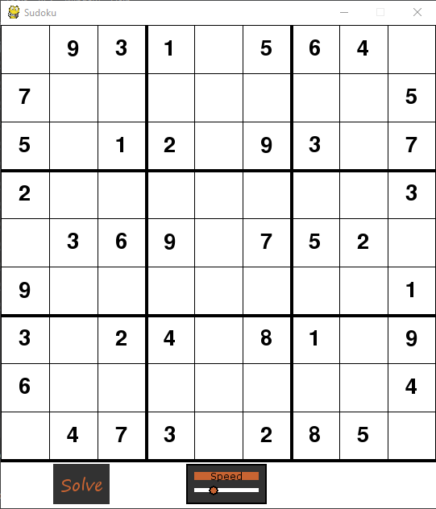

# Sudoku-Solver-Visualization

This is a Sudoku solver with visualization. It  gives a clear visualization of solving sudoku using the Backtracking algorithm.

## Usage

excute sudoku.py

```
python3 sudoku.py
```
---
press `space` to start solving.

